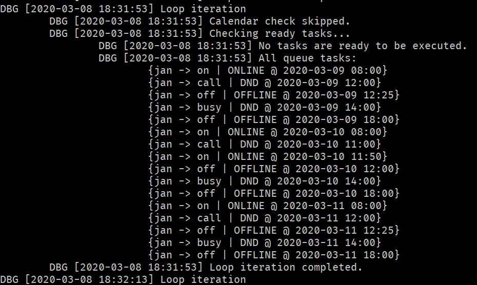

# gcal-mm-status

This application reads events from Google Calendar and, according to defined patterns, updates the user status and nickname
on Mattermost. It allows for handling multiple users within one Mattermost server, where each one can have their own calendar 
and settings.



## Requirements

1. Python 3.7 or higher and `pip` in the corresponding version.
2. Access to Google API and Mattermost API.
3. Patience. The installation process may be a bit cumbersome, because we need to integrate with Google API, Mattermost and then authenticate
the Google user. 

## Instalation

1. Run `pip install -r requirements.txt` from the app directory to install all required Python packages.
1. Obtain a file with Google API credentials (from [here](https://developers.google.com/calendar/quickstart/python)) 
    and store it in `credentials/google.json`.
2. Provide Mattermost configuration in `credential/mattermost.json` in this format:
    ```json
    {
      "server": "chat.server.com",
      "token": "API token goes here"
    }
    ```
3. Configure the application by editing `settings.json` in its root directory, according to instructions below.
4. Upon the first execution, the access to each Google user whose calendar is being accessed may be requested.

**

## Configuration

The configuration file `settings.json` should have the following structure:
```json
{
  "user_settings": {

    "$USER_NAME": {
      "mattermost_login": "$MATTERMOST_USER_NAME",
      "gcal_token_file": "$USER_TOKEN_FILE",

      "patterns": [
        {
          "pattern": "$REGEX_PATTERN",
          "flags": [
            "IGNORECASE"
          ],
          "suffix": "$SUFFIX",
          "status": "$STATUS"
        },

        ...

      ],
      "default_chat_state": {
        "suffix": "$SUFFIX",
        "status": "$STATUS"
      }
    },

    ...

  }
}
```

- `$USER_NAME`: Identifier of the entry. It is suggested to keep it the same as `$MATTERMOST_USER_NAME`.
- `$MATTERMOST_USER_NAME`: Name of the user on the Mattermost server.
- `$REGEX_PATTERN`: Pattern that will be applied on the calendar event's summary, and if it matches, it becomes actionable.
     Be mindful about backslashes, they need to be doubled in JSON: `"^work.*\\(dnd\\).*"`
- `$SUFFIX`: A suffix that will be added to the Mattermost nickname like `nickname|suffix` when applying the chat state.
- `$STATUS`: Mattermost status: `on`|`away`|`dnd`|`off`.

